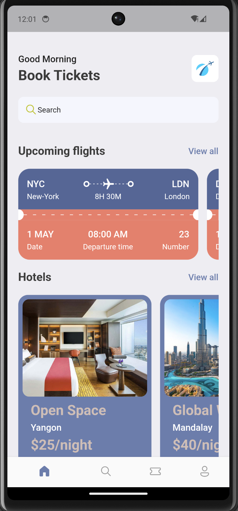
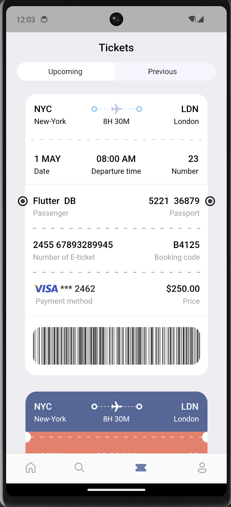
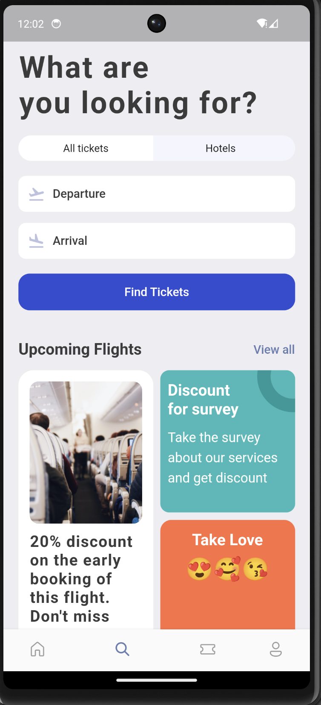
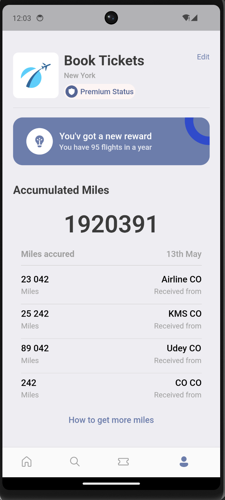
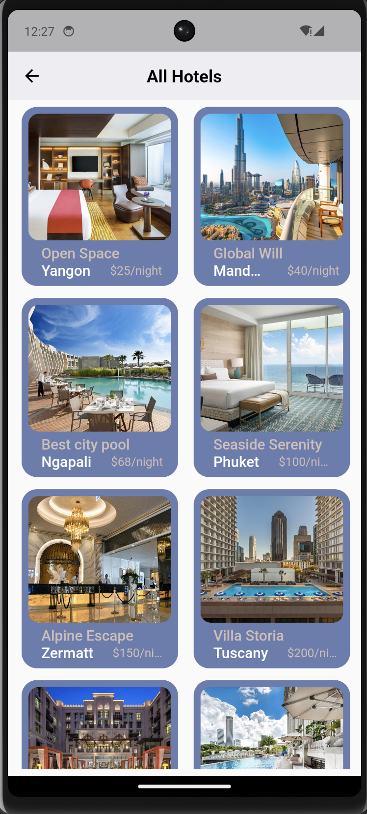
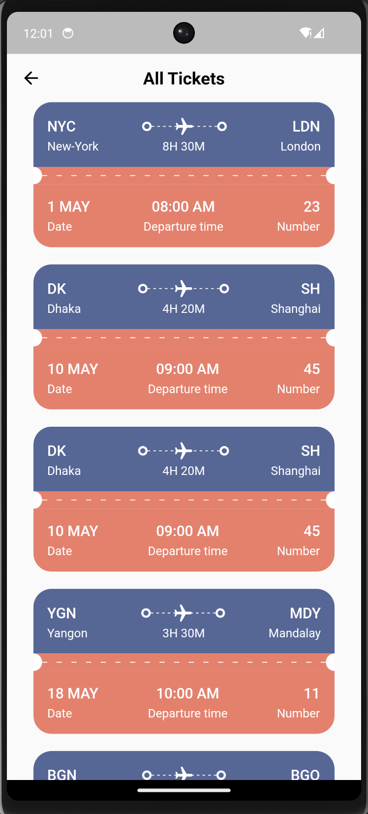

# ticket_app

# Ticket App UI

A Flutter-based mobile UI application that showcases a clean and modern design for a ticket booking system. This project includes screens like Home, Tickets, Search, Profile, Hotels, and more — all with smooth navigation and responsive layouts.

---

## 📱 Screens Available

Here are the main screens included in this app:

- **Home Screen**
- **Ticket Screen**
- **Search Screen**
- **Profile Screen**
- **All Hotels Screen**
- **All Tickets Screen**
- **Hotel Details Screen**

---

## 📷 Screenshots

| Screen         | Image                                                                                   |
|----------------|-----------------------------------------------------------------------------------------|
| Home           |      |
| Ticket         |             |
| Search         |              |
| Profile        |            |
| All Hotels     |      |
| All Tickets    |    |
| Hotel Detail   |  |

---

## 🛠️ Tech Stack

- **Flutter** – For building the UI
- **Dart** – Language used

---
